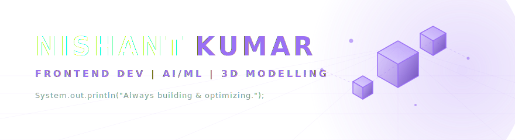

<!-- Custom Sleek Dark Minimalist Header Banner -->

  

<!-- Dynamic Typing Subtitle -->

  

 

<!-- About Me & Connect Side-by-Side Grid -->
<table border="0" width="100%" style="border-collapse: collapse;">
  <tr style="border: none;">
    <td width="60%" style="border: none; vertical-align: top; padding-right: 20px;">
      <h3>💫 About Me</h3>
      
I am a Computer Science student passionate about crafting clean user interfaces, building autonomous AI-driven applications, and exploring 3D animations.

      <ul>
        <li>🎓 <b>2nd Year CS Student</b> @ Siksha 'O' Anusandhan, Bhubaneswar</li>
        <li>🥑 <b>Core Technical Member</b> @ Google Developer Group on Campus (GDGoC)</li>
        <li>💻 Focusing on <b>AI/ML</b>, <b>Frontend Development</b>, and <b>Local LLM Inference</b></li>
        <li>📈 Practicing Data Structures &amp; Algorithms and competitive programming</li>
        <li>☕ Obsessed with <b>3D modelling (Blender)</b> and technical animations</li>
        <li>🌱 Always shipping new ideas and optimizing developer workflows</li>
      </ul>
    </td>
    <td width="40%" style="border: none; vertical-align: top; text-align: center; border-left: 1px solid rgba(154, 112, 245, 0.2); padding-left: 20px;">
      <h3>🌐 Connect With Me</h3>
       
      
        
      
        
      
    </td>
  </tr>
</table>

 

 

<!-- Featured Projects -->
## 🚀 Current Progress & Projects

*   **🌾 AgriVision** — *AI/ML Crop & Disease Intelligence*
    An integrated AI/ML solution combining computer vision (CNNs) for leaf disease detection and machine learning for soil-based crop recommendation.
     
    `Python` • `TensorFlow` • `Scikit-Learn` • `OpenCV`

*   **🎬 Manim-DSA AI Animator** — *Autonomous Animation Platform*
    Building a platform that autonomously generates Manim animations from natural language using a self-healing LLM loop, RAG, and ChromaDB.
     
    `Next.js` • `Python` • `LangChain` • `ChromaDB` • `Local LLMs`

*   **🤖 Local AI & Automation** — *Local LLM Integrations*
    Experimenting with local LLM inference (Gemma, Llama) via LM Studio/Ollama and managing technical bot integrations for community servers.
     
    `Ollama` • `LM Studio` • `Python` • `Discord API`

 

 

<!-- Tech Stack Section -->
## 💻 Tech Stack

### Languages & Markup

### Frontend & Frameworks

### Backend & Infrastructure

### AI / ML & Data Science

### Creative & Design

 

 

<!-- GitHub Stats Section -->
## 📊 GitHub Stats & Metrics

  
  

  

  

 

 

<!-- Footer & Visitor Counter -->

  

